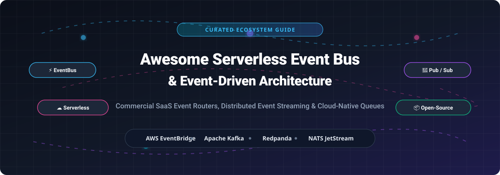

# ⚡ Awesome Serverless Event Bus & Event-Driven Architecture

  
  
  
  
  

  

## 🚀 Overview & Ecosystem Guide

Welcome to the definitive, community-curated index of **Serverless Event Buses**, **Commercial Cloud Event Routers**, and **Open-Source Event Streaming Engines**.

Event-Driven Architecture (EDA) is a foundational software design pattern that enables decoupled microservices, real-time data streaming, asynchronously orchestrated background workflows, and resilient cloud-native applications. This repository provides platform engineers, cloud architects, and backend developers with complete pricing transparency, open-source star metrics, and enterprise market analysis across the event-driven ecosystem.

---

## 📑 Table of Contents

- [📊 SaaS & Hosted Commercial Event Platforms](#-saas--hosted-commercial-event-platforms)
- [📦 Top Open-Source Event-Driven Infrastructure](#-top-open-source-event-driven-infrastructure)
- [🌐 Open Standards & Interoperability](#-open-standards--interoperability)
- [💡 Architectural Patterns & Cheat Sheet](#-architectural-patterns--cheat-sheet)
- [🤝 How to Contribute](#-how-to-contribute)
- [⚠️ Disclaimer](#%EF%B8%8F-disclaimer)
- [💖 Support & Community](#-support--community)
- [⭐ Star History](#-star-history)

---

## 📊 SaaS & Hosted Commercial Event Platforms

📊 **Market Overview & Landscape**: The global Event-Driven Architecture (EDA) & Integration Platform market is estimated at **$11.8 Billion in 2026** and is projected to expand to **$26.4 Billion by 2030** (18.5% CAGR). The market is **moderately fragmented**: major cloud hyperscalers (Microsoft, AWS, Google Cloud) command core enterprise cloud event infrastructure, while agile specialized platforms (Confluent, Redpanda, CloudAMQP, Upstash, Inngest, Trigger.dev) pioneer high-throughput streaming, zero-latency serverless queues, and durable workflow execution.

The table below lists top managed SaaS event bus and streaming platforms, sorted by **Est. Company Size (Valuation / Market Cap)** in descending order:

| Platform | Parent Company | Est. Company Size (Valuation / Market Cap / Rev) | Starting Paid Tier Price | Free Tier / Trial Limit | Key Feature & Best For |
| :--- | :--- | :--- | :--- | :--- | :--- |
| **[Azure Event Grid](https://azure.microsoft.com/en-us/products/event-grid/)** ☁️ | Microsoft | **~$3.10 Trillion** *(Market Cap)* | **$0.60 per 1 million operations** | **100,000 operations free** per month forever | Fully managed event routing with native Azure integration, dead-lettering, and CloudEvents support. |
| **[Amazon EventBridge](https://aws.amazon.com/eventbridge/)** ⚡ | Amazon (AWS) | **~$1.95 Trillion** *(Market Cap)* | **$1.00 per 1 million events** published | **1,000,000 events free** per month (AWS Free Tier 12-Month) | Enterprise serverless event bus with schema registry, event replay, cross-account routing, and 300+ SaaS connectors. |
| **[Google Cloud Eventarc](https://cloud.google.com/eventarc)** 🌐 | Alphabet (Google) | **~$1.90 Trillion** *(Market Cap)* | **$0.40 per 1 million events** (+ Cloud Run / PubSub costs) | **100,000 events free** per month forever | Standardized CloudEvents delivery to GCP Cloud Run, GKE, and Cloud Functions with Cloud Audit Logs triggers. |
| **[Confluent Cloud](https://www.confluent.io/confluent-cloud/)** 🔄 | Confluent, Inc. *(NASDAQ: CFLT)* | **~$6.50 Billion** *(Market Cap)* / $950M+ Rev | Pay-as-you-go starting at **$0.13/hour per cluster** + $0.10/GB data | **$400 free credit** valid for the first 30 days of sign-up | Enterprise-grade fully managed Apache Kafka with serverless clusters, ksqlDB, Flink streaming, and 120+ managed sinks/sources. |
| **[Redpanda Cloud](https://redpanda.com/)** 🚀 | Redpanda Data | **~$750 Million** *(Valuation / Series C)* | Serverless tier starts at **$0.08 per GB ingested** + $0.05/GB stored | **$300 free trial credits** valid for 14 days | C++ based Kafka-API compatible streaming platform. No JVM, zero Zookeeper dependencies, delivering up to 10x lower latency. |
| **[RabbitMQ Cloud (CloudAMQP)](https://www.cloudamqp.com/)** 🐰 | 84codes | **~$150 Million** *(Est. Valuation)* | **$0.05 per hour** ($36/month) on "Little Lemur" plan | **"Little Monkey" plan free forever** (1,000,000 msgs/mo, 20 max connections) | Managed RabbitMQ clusters supporting AMQP, MQTT, and STOMP protocols with automated monitoring and multi-cloud hosting. |
| **[Upstash QStash](https://upstash.com/qstash)** ⚡ | Upstash | **~$50 Million** *(Est. Valuation)* | **$0.20 per 100,000 messages** (or Pro plan at $180/month) | **500 free requests per day** forever (15,000 requests/month) | 100% serverless HTTP-based message queue and event scheduler designed for Vercel, Next.js, and serverless edge runtimes. |
| **[Inngest](https://www.inngest.com/)** 🔮 | Inngest, Inc. | **~$30 Million** *(Est. Valuation)* | **$50/month** Team plan (includes 250,000 step executions) | **50,000 step executions free** per month forever | Event-driven workflow platform that turns serverless functions into durable step functions with automatic retries and state management. |
| **[Trigger.dev](https://trigger.dev/)** 🎯 | TriggerDotDev Inc. | **~$20 Million** *(Est. Valuation)* | **$10/month** Hobby Pro plan (includes 50,000 task runs) | **5,000 task runs & 500 execution hours free** per month forever | Open-source background jobs and event-driven orchestration framework for long-running AI agents and Node.js tasks. |

---

## 📦 Top Open-Source Event-Driven Infrastructure

The open-source domain provides high-performance messaging backbones, distributed log storage, change data capture (CDC), and durable workflow execution engines.

The list below is sorted strictly by **GitHub Star Count** in descending order. Each star badge links directly to that repository's stargazers page:

1. **[Apache Kafka](https://github.com/apache/kafka)**   
   🏷️ *Apache-2.0 License* | 🏆 **33,900+ Stars**  
   The industry de facto standard for distributed event streaming. Features horizontal partitioning, high-throughput pub/sub log storage, Kafka Connect integration, and Kafka Streams for real-time stream processing.

2. **[Apache Flink](https://github.com/apache/flink)**   
   🏷️ *Apache-2.0 License* | 🏆 **26,300+ Stars**  
   Stateful stream processing framework providing low-latency event-by-event computations over unbounded and bounded data streams with strong exactly-once state consistency.

3. **[Dapr (Distributed Application Runtime)](https://github.com/dapr/dapr)**   
   🏷️ *Apache-2.0 License* | 🏆 **26,100+ Stars**  
   Cloud-native microservices runtime offering pluggable event-driven pub/sub components, state management, bindings, and actor frameworks across cloud providers.

4. **[NSQ](https://github.com/nsqio/nsq)**   
   🏷️ *MIT License* | 🏆 **25,700+ Stars**  
   A realtime distributed messaging platform designed to operate at scale, eliminating single points of failure and favoring high availability and low latency delivery.

5. **[Temporal](https://github.com/temporalio/temporal)**   
   🏷️ *MIT License* | 🏆 **23,400+ Stars**  
   Open-source durable execution platform that orchestrates complex, event-driven stateful workflows that automatically resume from failure points without data loss.

6. **[Vector](https://github.com/vectordotdev/vector)**   
   🏷️ *MPL-2.0 License* | 🏆 **22,600+ Stars**  
   High-performance, memory-safe Rust observability data pipeline for collecting, transforming, and routing massive log, metric, and event streams.

7. **[Apache RocketMQ](https://github.com/apache/rocketmq)**   
   🏷️ *Apache-2.0 License* | 🏆 **22,600+ Stars**  
   Cloud-native messaging and streaming engine optimized for financial-grade transactional messages, ultra-low latency, and high-concurrency e-commerce event handling.

8. **[NATS JetStream](https://github.com/nats-io/nats-server)**   
   🏷️ *Apache-2.0 License* | 🏆 **20,800+ Stars**  
   Ultra-fast cloud & edge native messaging system in Go. Offers pub/sub, request-reply, multi-tenancy, and persistent stream storage with minimal memory footprint.

9. **[Trigger.dev](https://github.com/triggerdotdev/trigger.dev)**   
   🏷️ *Apache-2.0 License* | 🏆 **16,400+ Stars**  
   Open-source background jobs framework for Node.js/TypeScript, designed to trigger durable event workflows, long-running tasks, and AI agent execution safely.

10. **[Apache Pulsar](https://github.com/apache/pulsar)**   
    🏷️ *Apache-2.0 License* | 🏆 **15,300+ Stars**  
    Next-generation distributed pub/sub messaging engine featuring multi-tenancy, tiered cloud storage (S3/GCS), geo-replication, and unified queuing and streaming.

11. **[RabbitMQ](https://github.com/rabbitmq/rabbitmq-server)**   
    🏷️ *MPL-2.0 License* | 🏆 **13,900+ Stars**  
    The most widely deployed open-source traditional message broker. Supports AMQP 0-9-1, AMQP 1.0, MQTT, STOMP, and flexible exchange routing patterns.

12. **[Debezium](https://github.com/debezium/debezium)**   
    🏷️ *Apache-2.0 License* | 🏆 **13,100+ Stars**  
    Open-source distributed platform for Change Data Capture (CDC). Converts database commit logs (PostgreSQL, MySQL, MongoDB) into real-time event streams.

13. **[Redpanda](https://github.com/redpanda-data/redpanda)**   
    🏷️ *BSL License* | 🏆 **12,500+ Stars**  
    Modern C++ event streaming platform fully compatible with Apache Kafka APIs. Eliminates JVM garbage collection pauses and Zookeeper complexity.

14. **[ZeroMQ (libzmq)](https://github.com/zeromq/libzmq)**   
    🏷️ *MPL-2.0 License* | 🏆 **11,000+ Stars**  
    High-performance asynchronous messaging library providing brokerless sockets across inproc, IPC, TCP, and multicast transports.

15. **[Watermill](https://github.com/ThreeDotsLabs/watermill)**   
    🏷️ *MIT License* | 🏆 **9,900+ Stars**  
    Go library for efficiently building event-driven systems. Supports Kafka, RabbitMQ, NATS, AWS SQS, and Google Cloud Pub/Sub with clean middleware.

16. **[BullMQ](https://github.com/taskforcesh/bullmq)**   
    🏷️ *MIT License* | 🏆 **9,400+ Stars**  
    Fast, rock-solid Redis-based message queue and job batching library supporting TypeScript, Python, and .NET.

17. **[Apache Beam](https://github.com/apache/beam)**   
    🏷️ *Apache-2.0 License* | 🏆 **8,600+ Stars**  
    Unified open-source programming model for defining batch and event-driven streaming processing pipelines across Flink, Spark, and Dataflow.

18. **[Apache Camel](https://github.com/apache/camel)**   
    🏷️ *Apache-2.0 License* | 🏆 **6,300+ Stars**  
    Versatile open-source integration framework based on Enterprise Integration Patterns (EIP) with 350+ out-of-the-box connectors.

19. **[CloudEvents Spec](https://github.com/cloudevents/spec)**   
    🏷️ *Apache-2.0 License* | 🏆 **5,900+ Stars**  
    CNCF Hosted Specification detailing common metadata structures to provide interoperability across event producers, routers, and consumers.

20. **[Inngest](https://github.com/inngest/inngest)**   
    🏷️ *Apache-2.0 / BSL License* | 🏆 **5,900+ Stars**  
    Developer-centric durable execution platform enabling serverless event-driven step functions, delays, and step-level retries without infra overhead.

21. **[EventStoreDB / KurrentDB](https://github.com/kurrent-io/KurrentDB)**   
    🏷️ *BSL License* | 🏆 **5,800+ Stars**  
    Operational stream database purpose-built for Event Sourcing and CQRS architecture patterns, storing immutable state change streams.

22. **[Apache ActiveMQ](https://github.com/apache/activemq)**   
    🏷️ *Apache-2.0 License* | 🏆 **2,400+ Stars**  
    Classic enterprise multi-protocol message broker supporting JMS 2.0, AMQP, MQTT, STOMP, and OpenWire protocols.

23. **[Knative Eventing](https://github.com/knative/eventing)**   
    🏷️ *Apache-2.0 License* | 🏆 **1,500+ Stars**  
    Kubernetes-native event routing subsystem supporting declarative brokers, triggers, channels, and CloudEvents bindings.

---

## 🌐 Open Standards & Interoperability

Building maintainable event-driven applications requires avoiding vendor lock-in. Key industry standards include:

- **[CloudEvents](https://cloudevents.io/)**: A CNCF specification for describing event data in common formats (JSON, Protobuf, Avro). Enables seamless routing across AWS, GCP, Azure, and open-source brokers.
- **[AsyncAPI](https://www.asyncapi.com/)**: An open specification for defining asynchronous, message-driven APIs (analogous to OpenAPI/Swagger for REST).
- **[AMQP 1.0](https://www.amqp.org/)**: ISO/IEC standard binary protocol for messaging, guaranteeing interoperability across hardware and cloud message brokers.

---

## 💡 Architectural Patterns & Cheat Sheet

| Pattern | Best Engine Choices | Primary Use Case | Key Advantage |
| :--- | :--- | :--- | :--- |
| **High-Throughput Log Streaming** | Apache Kafka, Redpanda | Clickstream analytics, telemetry, centralized log aggregation | High disk bandwidth & sequential partition log reads |
| **Cloud Serverless Event Bus** | AWS EventBridge, Azure Event Grid | Decoupling microservices across AWS/Azure accounts & SaaS tools | Pay-per-event, zero idle server maintenance |
| **Low-Latency Edge Messaging** | NATS JetStream, ZeroMQ | IoT device communication, gaming servers, real-time sync | Microsecond latency, ultra-light memory footprint |
| **Durable Function Orchestration** | Inngest, Trigger.dev, Temporal | Long-running background jobs, AI agent loops, multi-step workflows | Auto-retry, state survival across container restarts |
| **CDC (Change Data Capture)** | Debezium + Kafka/Pulsar | Database sync, cache invalidation, audit logging | Captures row-level database changes non-intrusively |

---

## 🤝 How to Contribute

Contributions are warmly welcomed! Please follow these simple guidelines:

1. Fork this repository.
2. Add or update entries following the established table / badge structure.
3. Ensure exact pricing data or accurate GitHub star count badges are included.
4. Submit a clean Pull Request explaining your additions.

Read awesome guidelines at [Awesome-Awesome-Awesome](https://github.com/ishandutta2007/Awesome-Awesome-Awesome).

---

## ⚠️ Disclaimer

- This list is **community-maintained** for educational and architectural evaluation purposes.
- Check vendor SLA guarantees, compliance standards (SOC2, HIPAA, GDPR), and licensing terms before deploying in mission-critical enterprise environments.
- Licensing note: Redpanda uses BSL, RabbitMQ uses MPL-2.0, NATS and Apache projects use Apache-2.0.

---

## 💖 Support & Community

Thank you for exploring this curated repository! If this guide helped you evaluate or architect your event-driven system, please consider:
- ⭐ **Starring this repository** to help others discover it!
- 🔀 **Forking and contributing** new event-driven tools and updates via Pull Request.
- 📢 **Sharing this repository** on Twitter/X, LinkedIn, or developer forums.

If you'd like to support ongoing open-source maintenance and curation work, you can sponsor via GitHub Sponsors:

---

## ⭐ Star History

---

  <b>Made with ❤️ for platform engineers, serverless developers, and event-driven architects worldwide.</b>

